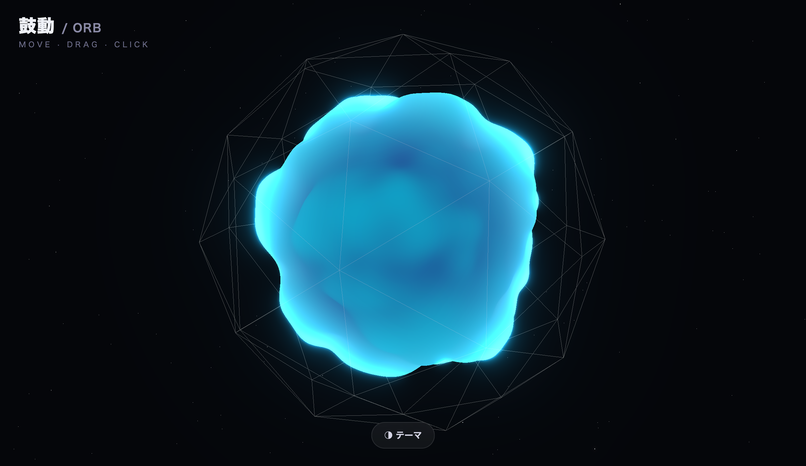
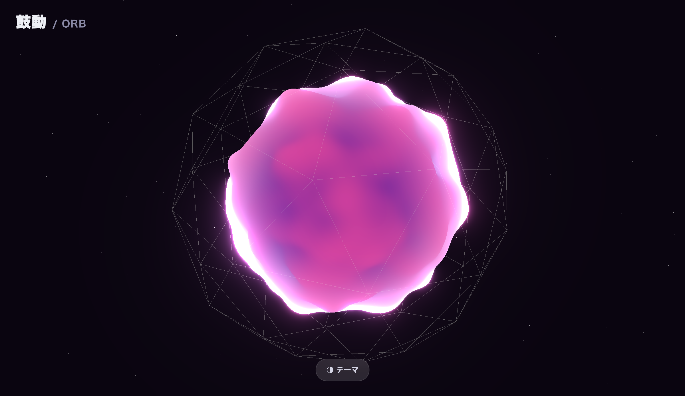

# ✺ 鼓動 / ORB

マウスに反応して**脈動・発光する3Dオーブ**。Three.js + カスタムGLSLシェーダーで、頂点をノイズで変位させ、フレネルのリム発光と UnrealBloom で光らせる。

🔗 **デモ: https://orb.1qaz.jp**




## 特徴

- **シェーダーで脈動するオーブ** — 頂点シェーダー内の 3D simplex noise で球体の表面が有機的にうねる
- **フレネルのリム発光 + ブルーム** — `EffectComposer` + `UnrealBloomPass` で縁が光る
- **マウスでエネルギー** — 動かすほど乱れと発光が増し、クリックで脈打つ
- カメラ視差、ワイヤーフレームの籠、星屑で奥行き
- **4つの配色テーマ**（テーマボタン / `Space`）

## 操作

- マウス／タッチを **動かす・ドラッグ・クリック**
- テーマボタン or `Space` で配色切替

## 技術

- Vite / Three.js / GLSL（`ShaderMaterial`）/ `EffectComposer` + `UnrealBloomPass`
- devicePixelRatio 対応、レスポンシブ、純静的サイト（PHPなし）
- シェーダーは [`src/shaders.js`](src/shaders.js)（snoise + 頂点変位 + フレネル）、シーンは [`src/main.js`](src/main.js)

## 開発

```bash
git clone https://github.com/masafykun/kodou-orb.git
cd <repo>
npm install
npm run dev      # http://localhost:5173
npm run build    # dist/
```

## ライセンス

MIT
